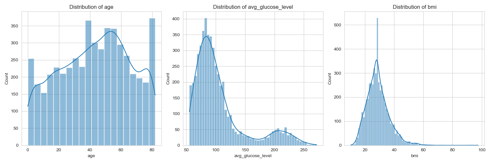
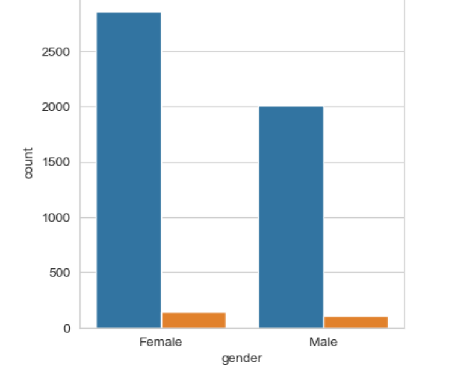
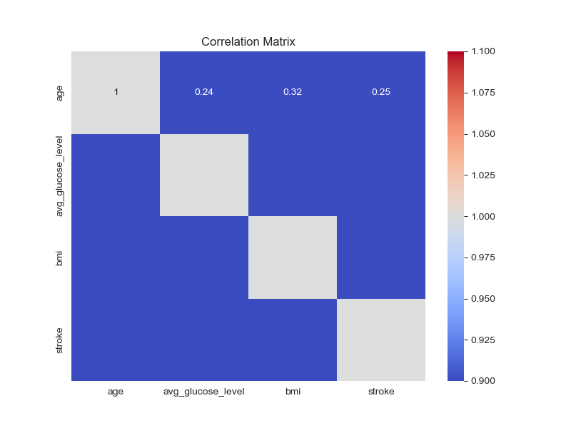
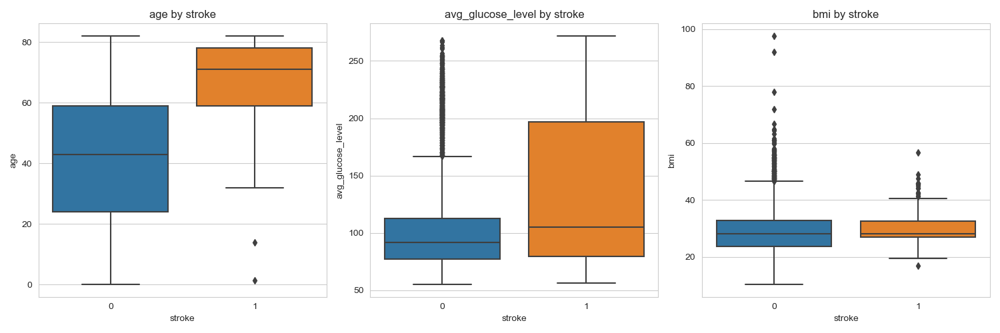
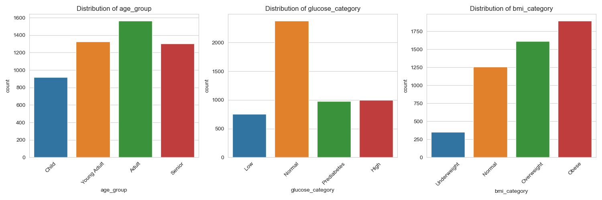
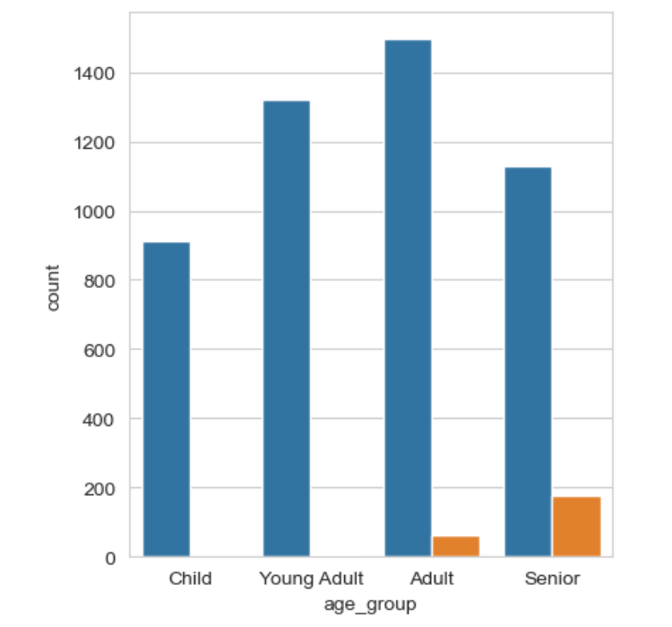
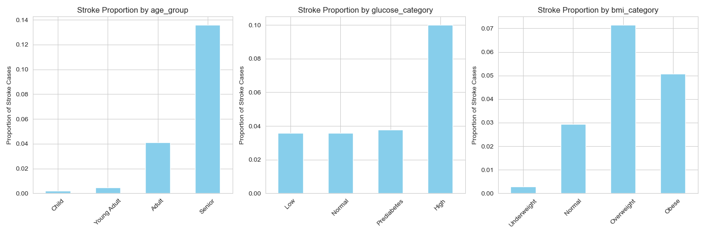

# Healthcare Stroke Data Cleaning and Visualization

## Overview
This project focuses on cleaning and visualizing a healthcare dataset to explore stroke risk factors. The dataset includes demographic and health-related features such as age, gender, BMI, glucose levels, and smoking status. The goal is to prepare a clean dataset and derive insights through visualizations, including engineered features, to understand stroke prevalence and risk factors.

## Dataset
- **Source**: `healthcare-stroke-data.xlsx`
- **Features**: `id`, `gender`, `age`, `hypertension`, `heart_disease`, `ever_married`, `work_type`, `Residence_type`, `avg_glucose_level`, `bmi`, `smoking_status`, `stroke`
- **Target**: `stroke` (binary: 0 = no stroke, 1 = stroke)
- **Size**: 5109 rows, 12 columns

## Project Structure
- `healthcare-stroke-data.csv`: Raw dataset
- `healthcare-stroke-data-cleaned.csv`: Cleaned dataset
- `stroke_analysis.ipynb`: Jupyter Notebook with data cleaning, visualization, and feature engineering
- `numeric-features-distribution.png`: Distribution of numeric features
- `stroke-by-categorical-features.png`: Stroke prevalence by categorical features
- `correlation-matrix.png`: Correlation matrix of numeric features
- `numeric-features-by-stroke.png`: Boxplots of numeric features by stroke
- `engineered-features-distribution.png`: Distribution of engineered features
- `stroke-by-engineered-features.png`: Stroke prevalence by engineered features
- `stroke-proportion-engineered-features.png`: Proportion of stroke cases by engineered features
- `README.md`: Project documentation

## Methodology
1. **Data Inspection**:
   - Explored dataset structure, identified missing `bmi` values ("N/A"), and confirmed no duplicates.
2. **Data Cleaning**:
   - Replaced "N/A" in `bmi` with NaN and imputed using the median.
   - Converted categorical columns (`gender`, `ever_married`, etc.) to `category` type and ensured numeric types.
   - Handled rare categories in `gender` (e.g., replaced 'Other' with 'Female' if low frequency).
3. **Data Visualization**:
   - Plotted distributions of numeric features (`age`, `avg_glucose_level`, `bmi`).
   - Visualized stroke prevalence across original categorical features (`gender`, `smoking_status`, etc.).
   - Created a correlation matrix for numeric features.
   - Generated boxplots to compare numeric features by stroke status.
   - Visualized distributions, stroke prevalence, and stroke proportions for engineered features (`age_group`, `glucose_category`, `bmi_category`).
4. **Feature Engineering**:
   - Created `age_group` (Child, Young Adult, Adult, Senior) based on age bins.
   - Created `glucose_category` (Low, Normal, Prediabetes, High) based on clinical glucose thresholds.
   - Created `bmi_category` (Underweight, Normal, Overweight, Obese) based on BMI thresholds.
   - Encoded categorical variables (`gender`, `ever_married`, etc.) using LabelEncoder for analysis.

5. **Output**:
   - Saved cleaned dataset as `healthcare-stroke-data-cleaned.csv`.
   - Saved visualizations as PNG files for documentation.

## Key Insights
- **Original Features**:
  - Older age is strongly associated with higher stroke risk, with most stroke cases occurring in individuals over 60.
  - Higher glucose levels (e.g., >100 mg/dL) correlate with increased stroke prevalence.
  - Smoking status (smokers and formerly smoked) shows higher stroke counts compared to non-smokers.
  - BMI has a less direct correlation but shows differences in stroke risk for higher values.
- **Engineered Features**:
  - **Age Group**: Seniors (age > 60) have a significantly higher stroke proportion compared to Children or Young Adults.
  - **Glucose Category**: High and Prediabetes categories (glucose > 100) are associated with increased stroke risk.
  - **BMI Category**: Obese individuals (BMI > 30) show a higher stroke proportion than Underweight or Normal categories.

## Visualizations
### Distribution of Numeric Features


### Stroke Prevalence by Categorical Features


### Correlation Matrix


### Numeric Features by Stroke


### Distribution of Engineered Features


### Stroke Prevalence by Engineered Features


### Proportion of Stroke Cases by Engineered Features


## Tools Used
- **Python**: Pandas, NumPy, Matplotlib, Seaborn, Scikit-learn
- **Jupyter Notebook**: For interactive analysis
- **Excel/CSV**: Data storage

## How to Run
1. Clone the repository:
   ```bash
   git clone https://github.com/SoyMaloDerze/healthcare-stroke-data-cleaning-visualization.git
